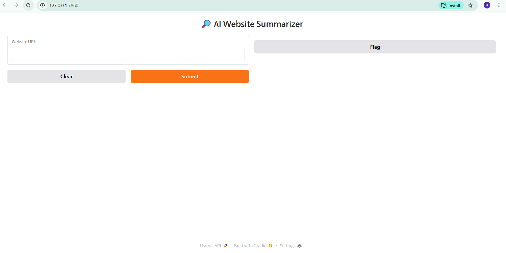
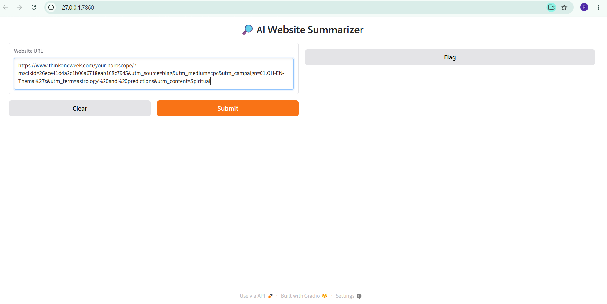
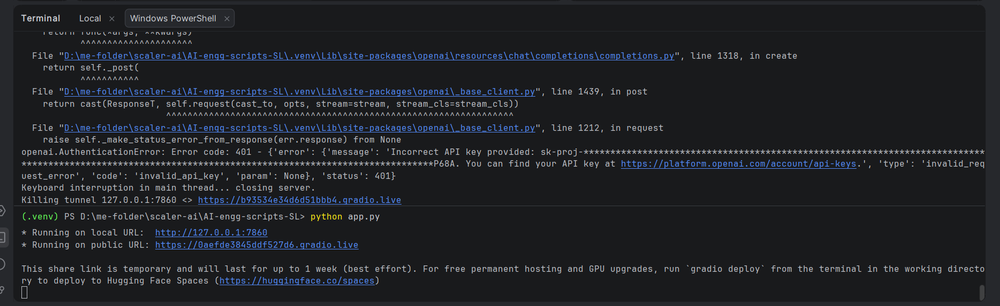
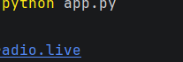
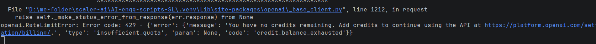
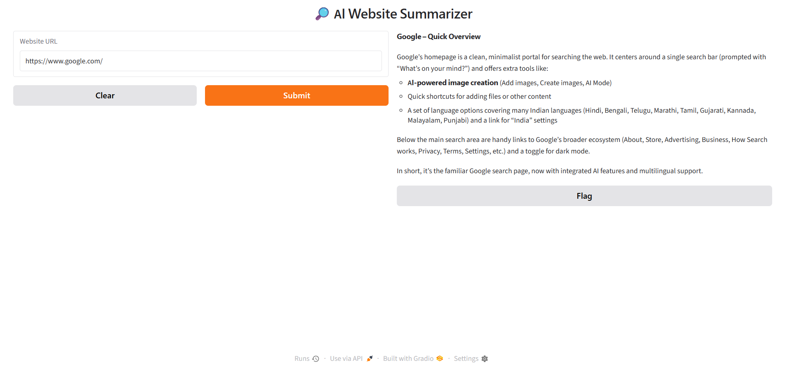

The project is a small Python/Gradio teaching project rather than a packaged application: It contains two main demos plus step-by-step API examples and static browser-based teaching pages.

**Project overview**

This is a small **AI Engineering Class 1 teaching/demo project** built around Python, OpenAI-compatible APIs, Groq, web scraping, and Gradio.

It demonstrates a progression from a first LLM API call to a live AI application:

1. Calling OpenAI with `gpt-4o-mini`
2. Calling Groq’s Llama model through the OpenAI-compatible API
3. Scraping website content with `requests` and `BeautifulSoup`
4. Summarizing scraped content with an LLM
5. Exposing the summarizer through a Gradio web UI
6. Comparing OpenAI and Groq responses in a two-model “LLM Arena”
7. Explaining LLM concepts through interactive HTML simulators

**Main files**

| File | Purpose |
|---|---|
| `app.py` | Gradio AI Website Summarizer |
| `scraper.py` | Fetches a URL, removes page noise, and extracts text |
| `summarizer.py` | Sends scraped content to OpenAI and returns Markdown |
| `arena_app.py` | Gradio app comparing OpenAI GPT and Groq Llama responses |
| `arena.py` | Partial/incomplete arena logic; not the main runnable entry point |
| `define_modal.py` | Minimal OpenAI API example |
| `openen.py` | Another minimal OpenAI API example |
| `groq_call.py` | Minimal Groq/Llama API example |
| `call_ai_app.py` | Complete step-by-step walkthrough combining all class concepts |
| `index.html` | Full Class 1 presentation/tutorial page |
| `simulators.html` | Separate interactive concept simulators |
| `.env` | Contains `OPENAI_API_KEY` and `GROQ_API_KEY` variable names; keep values private |

**What has been done**

**How to run on Windows**

The existing `.venv` appears to have a Unix-style layout (`.venv/bin`) and is not usable as a normal Windows virtual environment.

After installing Python 3.12 or newer, open PowerShell in the project directory and run:

```powershell
py -3 -m venv .venv
.\.venv\Scripts\Activate.ps1
python -m pip install --upgrade pip
python -m pip install openai python-dotenv requests beautifulsoup4 gradio
```

Create or update `.env` with:

```env
OPENAI_API_KEY=your-openai-key
GROQ_API_KEY=your-groq-key
```

Then run the main demos:

```powershell
python app.py
```

This starts the **AI Website Summarizer**. Enter a website URL in the Gradio page.

```powershell
python arena_app.py
```

This starts the **LLM Arena**, sending the same prompt to OpenAI and Groq and displaying both answers.

```powershell
python class1.py
```

This runs the complete teaching walkthrough and launches the summarizer UI. It makes multiple API calls and uses `share=True`, which creates a public Gradio link.

For the smaller examples:

```powershell
python first_class.py
python openen.py
python groq_call.py
```

These require the corresponding API key and make live API requests.

**HTML pages**

The static teaching pages can be opened directly:

```powershell
Start-Process .\index.html
Start-Process .\simulators.html
```
`index.html` is the complete lesson covering LLMs, tokens, API calls, website summarization, and deployment. `simulators.html` contains interactive tokenizer, temperature, API round-trip, self-supervision, and summarizer demonstrations.

**Current limitations**

- Python is not currently installed or discoverable from this Windows environment.
- No dependency manifest exists; dependencies are documented only in comments.
- No IDE run configurations are defined.
- `arena.py` references clients that are not defined, so use `arena_app.py` instead.
- The applications depend on external OpenAI/Groq APIs and valid keys.
- `share=True` exposes a public demo URL; disable it if a local-only launch is preferred by changing it to `share=False`.

**Install Python on this Windows machine**
Open PowerShell and run:
winget install --id Python.Python.3.12 -e --source winget
Close and reopen PowerShell after installation

Verify the installation
1. py --version
2. python --version
3. python -m pip --version

Create a virtual environment for this project
From the project directory:
\cd.....
py -3.12 -m venv .venv
The existing .venv appears to use a Unix-style layout, so if the command reports that the environment already exists, rename it before recreating:
Rename-Item .venv .venv-old
py -3.12 -m venv .venv

Activate the environment
.\.venv\Scripts\Activate.ps1
If PowerShell blocks activation, run this once for your user account:
Set-ExecutionPolicy -Scope CurrentUser RemoteSigned
Then activate again:
.\.venv\Scripts\Activate.ps1
You should see (.venv) at the beginning of the PowerShell prompt.

Install project dependencies
python -m pip install --upgrade pip
python -m pip install openai python-dotenv requests beautifulsoup4 gradio
Confirm the packages:
python -m pip list

Configure API keys
Create or edit the project’s .env file:
OPENAI_API_KEY=your-openai-api-key
GROQ_API_KEY=your-groq-api-key
Do not commit this file to Git.

Run the project
For the website summarizer:
python app.py
For the OpenAI-vs-Groq comparison app:
python arena_app.py
For the complete class walkthrough:
python class1.py

Configure IntelliJ IDEA
In IntelliJ IDEA:
1.
Open File → Project Structure → SDKs
2.
Add or select:
D:\me-folder\scaler-ai\AI-engg-scripts-SL\.venv\Scripts\python.exe
3.
Go to Settings → Project → Python Interpreter
4.
Select that same .venv interpreter
5.
Open the Python file you want to run
6.
Right-click it and choose Run

Add Python to your user PATH
Run this PowerShell command:
$pythonDir = "C:\Users\Shiv Piya\AppData\Local\Programs\Python\Python312"
$scriptsDir = "$pythonDir\Scripts"
$userPath = [Environment]::GetEnvironmentVariable("Path", "User")
$entries = @($userPath -split ';' | Where-Object { $_ -and $_ -ne $pythonDir -and $_ -ne $scriptsDir })
$newPath = (($entries + $pythonDir + $scriptsDir) -join ';')

[Environment]::SetEnvironmentVariable("Path", $newPath, "User")

Create the project environment
After reopening PowerShell:

python -m venv .venv
.\.venv\Scripts\Activate.ps1
python -m pip install --upgrade pip
python -m pip install openai python-dotenv requests beautifulsoup4 gradio
If .venv already exists and activation fails because it was created with a different platform, rename it first:
Rename-Item .venv .venv-old
python -m venv .venv
Then activate it:
.\.venv\Scripts\Activate.ps1

With (.venv) visible in your terminal, install the project dependencies:
python -m pip install --upgrade pip
python -m pip install openai python-dotenv requests beautifulsoup4 gradio
Verify the environment:
python --version
python -m pip list
Then run the main website summarizer:
python app.py
Open the local Gradio URL shown in the terminal, usually:
http://127.0.0.1:7860
For the two-model comparison app, stop the first app with Ctrl+C, then run:
python arena_app.py
Make sure .env contains:
OPENAI_API_KEY=your-openai-api-key
GROQ_API_KEY=your-groq-api-key

RUN=TRIALS-ERRORS-OUTPUT





